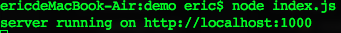
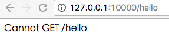
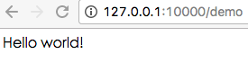

# 最简服务器创建与URL机制讲解

vig框架的目标是快速的完成Web业务的开发，同时提升模块化水平。

目标听起来很完美，如果无法付之行动，那么就是没有意义的。

所以在这个系列文章中，我们将会陆续介绍vig框架的使用。

这一节我们介绍如何使用vig做一个最简单的hello world服务器。

## 基础步骤
要完成一个最基本的vig服务器，只需要完成以下三步：   

1、引入基础服务器   

目前vig只测试了express的代码，所以只能支持express的基础服务器，
因为需要引入一个express服务器   

2、初始化vig系统  

3、添加一个handler服务器  

## 代码示例

所以完成后的代码就是这样的：

```node
var app = require('express')();
var vig = require('vig');
vig.init(app);
vig.addHandler(app, {
  urls: ['/'],
  routers: {
    get: function (req, res) {
      res.send('Hello world!');
    }
  }
});

app.listen(10000, function () {
  console.log('server running on http://localhost:1000');
});

```

## 运行效果

然后

```
node index.js
```

运行一下：




启动成功。

然后通过浏览器打开，效果如下：


我们得到了hello world!输出。

是不是很简单呢？

## url别名

如果你注意的话，会发现handler里使用的是urls.
原因很简单，vig是支持URL别名机制的。
所以你可以填写多个URL地址而得到同样的处理。

比如我在urls上添加一个新的地址：
```
  urls: ['/'， '/hello'],
```
这时再访问浏览器，一样可以得到相同的返回结果。
效果如下图，注意地址栏上多出来的'/hello'。


## url前缀

vig框架提供了简单的前缀机制。
只要在handler里添加prefix字段，就可以实现前缀机制了。这对于项目不同的版本的维护可以带来很大的便利性。

```node
var app = require('express')();
var vig = require('vig');
vig.init(app);
vig.addHandler(app, {
prefix: '/demo',
  urls: ['/'],
  routers: {
    get: function (req, res) {
      res.send('Hello world!');
    }
  }
});

app.listen(10000, function () {
  console.log('server running on http://localhost:1000');
});

```

然后分别访问几个地址的结果如下：







prefix后，所有的url都加上了/demo前缀，之前的URL地址就失效了。

以上就是vig的简单的使用教程，是不是很简单呢？

欢迎留言告诉我你的问题.


