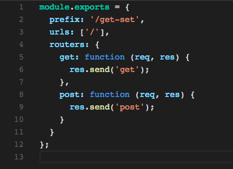
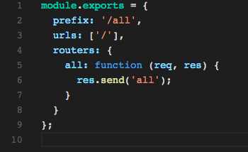
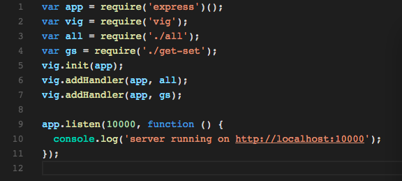
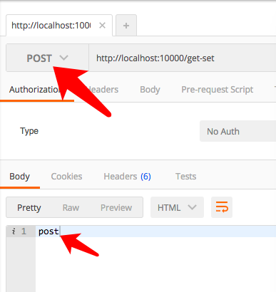
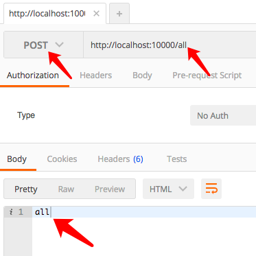

# vig对HTTP方法的支持与提供的几种处理机制介绍

上一讲我们讲到了vig的url机制里的：

1. 别名机制
2. 前缀机制

这一讲我们来讲解vig的：

1. 增强机制
2. 增强机制的HTTP处理方式
3. vig api的规范以及提供的http方法

vig框架最首要的目标是减少开发过程中的重复劳动，提升开发者的生产率。
让开发者可以不被常规的web业务所分心，集中精力将业务功能快速，安全的开发出来。

所以vig框架最大的核心功能就是这些用于减少开发量的增强功能。

所以我们下面一起来看一下增加功能都有那些，以及这些增强如何处理不同的http请求方法。

## 增强机制(enhancements)

1. routers
2. validations
3. policies
4. failures
5. conditions

这些增强是vig得以加速开发的根本所在，也是vig的最核心功能。

以后的章节，我们将会详细的介绍每个模块的用法。

现在我们简单的介绍一下：

1. routers 是对HTTP方法的路由与处理，是所有处理的核心。
2. validations 是对路由上的数据进行校验，如果错误则会中断处理，并返回错误信息。如果正确则会直接提取校验数据，而忽略其它的数据。
3. policies 是对路由用户权限的一种检验，只有通过权限校验的用户才有权访问。

下面我们介绍他们对各种http方法的统一处理格式。

## http方法的处理机制

所有的vig增强都是针对http方法处理的。

基本格式如下：

```
enhancements : {
  method: [function | object]
}
```

1. enhancements就是上面列举的几个增强的名字。比如我们上一节使用的routers.
    未来如果我们的vig进一步的扩展，可能会有更多的增强关键字。而你只需要在关键字属性上添加你的处理就可以了。
2. method就是express支持的所有HTTP方法，不合法的HTTP方法会被自动的忽略，所以在编写时要注意方法写正确，并且是以字母小写的形式书写。
3. method同时支持all方法，all方法表示接受所有的HTTP请求，一般不建议使用。

所以如果我们要对routers的get与set都进行处理，我们的处理函数就会是这样的。

vs code 编辑器上的效果:

;

原始代码：

```node
// get-set.js
module.exports = {
  prefix: '/get-set',
  urls: ['/'],
  routers: {
    get: function (req, res) {
      res.send('get');
    },
    post: function (req, res) {
      res.send('post');
    }
  }
};

```


如果我们要对所有的方法进行处理，我们的处理函数就会是这样的。

vs code 编辑器上的效果:

;

原始代码：

```node
// all.js
module.exports = {
  prefix: '/all',
  urls: ['/'],
  routers: {
    all: function (req, res) {
      res.send('all');
    }
  }
};

```

我们给上面的处理加上了前缀，所以就可以一起将他们放到vig框架里了。

因此我们的框架代码就是这样的。

vs code 编辑器上的效果:

;

原始代码：

```node
var app = require('express')();
var vig = require('vig');
var all = require('./all');
var gs = require('./get-set');
vig.init(app);
vig.addHandler(app, all);
vig.addHandler(app, gs);

app.listen(10000, function () {
  console.log('server running on http://localhost:10000');
});
```
这里大家可以看到，我们的addHandler加载的是一个包。
所以基于这一点，我们是不是就可以很方便的去组成我们的处理函数了呢？

下面我们运行一下主函数:
```
node index.js
```

然后得到：

;


运行成功。

然后我们分别查看几个URL上的返回结果。由于这次我们的结果需要POST请求的支持，所以我使用POSTMAN来测试。

效果如下：

1. get 
    
2. post
    
3. all
    
​
是不是很简单呢？

通过这个示例，我们可以看出来，vig倾向于在同一个URL上一起处理所有的逻辑，并将他们归类到一起处理。

所以其它的增强也跟routers是一样的遵循这个基本的使用原则。所以只要理解了rourters的使用，就理解了整个vig增强体系。

vig 框架除了增强了Web业务的处理，也对API的设计有自己的理解。因些我们制定有vig api规范（原名egg api），因为egg的npm包被占用，所以egg框架改名为vig。

## 基于vig api规范(原egg api)，对HTTP方法与URL使用的一些建议


1. 如果你的API是返回的业务数据，只使用HTTP的GET/POST。GET用于获取、查询数据，POST用于提交，删除，修改数据。
2. 不建议使用其它的HTTP方法，除非一定需要
3. 对于API来说，应尊重URL用于定位的理念，即URL上尽量只保留名词，将方法使用query形式提交.即user/1?action=edit. 
    未来的版本里，vig将会添加这一支持.让资源/业务定位的理念在框架上有更好的实现。
4. vig api本身并不是完全支持RESTful api的理念的，vig api更加支持业务实际，但是RESTful api里很多先进的理念会被vig api继承下来。


## 相关资源的地址

vig api(即egg api，未来将会改名成vig api)规范地址：

 [https://github.com/calidion/egg](https://github.com/calidion/egg)

vig 框架地址：

[https://github.com/calidion/vig](https://github.com/calidion/vig)

这样vig框架的C(Controller)端的基本核心机制就已经介绍完了，是不是很简单呢？

下一节，我们将会介绍如何对数据进行校验，以及如何使用校验后的数据。

如果你有对框架或者文章的疑问或者建议，欢迎到github上提问或者留言。也可以关注公共账号:frontend-guru并留言。


