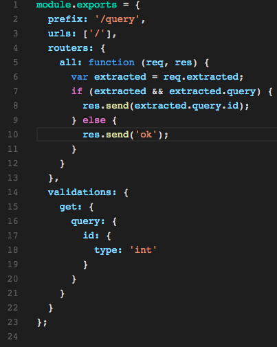
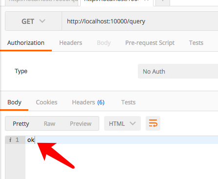
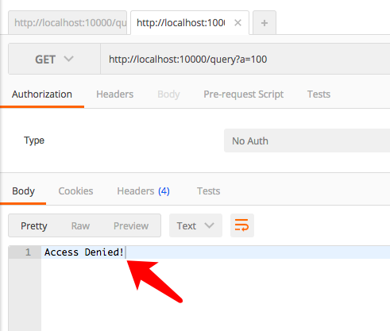
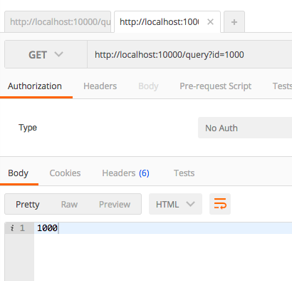
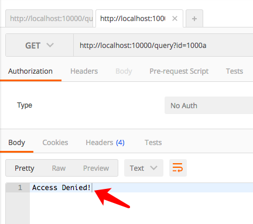
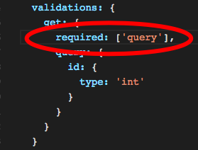
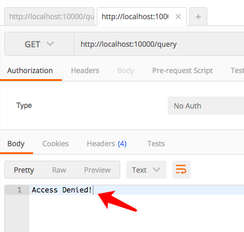
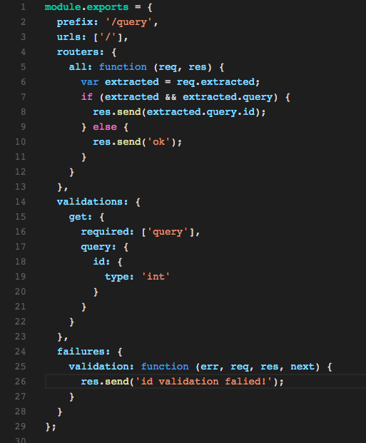
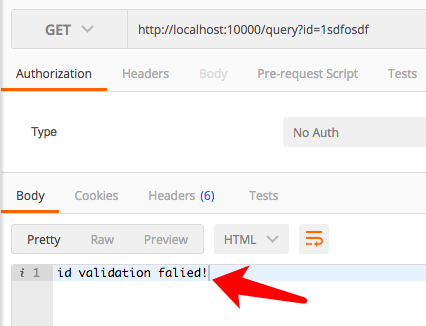

# 通过vig实现对输入数据的校验与提取

通常输入数据的校验对于程序的安全性来讲是非常重要的，但是检验数据通常又会变成非常无聊、重复、浪费时间的事情。
所以vig框架希望能将开发者从这部分工作中解脱出来。
因此提供了validations和conditions来协助用户更加有效，方便，灵活的对数据进行校验。
本篇文章主要介绍validations的使用。

# validation机制——vig的Web业务增强功能之一

vig的validation支持是通过validations字段来实现的。而validations属于我们上一篇介绍的几个基本增强，所以用法跟routers一样。
但是validations支持object验证，以及提取，所以会比routers要复杂一些。

# 基本的validation用法。
validation可以支持的数据输入类型有三类：
1、query，即<code>？</code>号后的内容,比如<code>?a=1&b=1</code>里的a和b.
2、params，即URL的Pattern所对应的内容，比如<code>/user/:id</code>里的id
3、body， 即post所提供的内容，比如post数据里的<code>a=1&b=1</code>里的a和b

> 暂时不支持文件的校验

## 校验query
query可以出现在post，也可以出现在get的请求里。
我们先看看出现在get里的情况，

vs code 编辑器上的效果:

;


原始代码：

```
module.exports = {
  prefix: '/query',
  urls: ['/'],
  routers: {
    all: function (req, res) {
      var extracted = req.extracted;
      res.send(extracted.query.id);
    }
  },
  validations: {
    get: {
      query: {
        id: {
          type: 'int'
        }
      }
    }
  }
};
```

我们基于以上代码发起请求:
分别得到如下的结果：

1. 没有带任何参数时



2. 带上非指定字段时:



3. 带上正确字段与正确的数值时：



4. 带上正确字段与错误的数值时：




## 疑问1：没有传入id时，竟然也到达了get处理

这里在没有通过验证ID的情况下，也可以通过，但是有没有办法让query的验证必须传入后才能通过到达get处理呢？

答案是：有的。 

在vig里只要在validations添加上

```
required: ['query'],
```
就可以要求query必须传入了。同样的，还可以添加上

```
required: ['query', 'params', 'body'],
```

要求所有的输入都必须有，且通过校验。

添加required后，我们的验证代码变成这样：



我们再查看<code>/query</code>不带参数的结果如下：



这时我们发现query已经返回403，内容是<code>Access Denied</code>了。

## 疑问2，如果出错了，想手动添加不同的处理，应该如何处理呢？

在vig框架里的处理也是很简单的那就是使用failures增强。

所以我们下面看一下如何手动的处理出错信息。

我们在handler里添加failures处理，代码如下：



这里我们重新启动服务器，再访问一个错误链接。

我们得到了下面的结果：



这时返回的不再是Access Denied!这个默认返回了。

这样你就可以根据需要自行处理错误结果了。

这里要注意的是: 

1. 在failures上添加错误处理时，字段名是单数的。
即 
  validations => validation
  policies => policy
  conditions => condition 
2. 处理必须是函数，参数分别是err, req, res, next
  err是表示失败的原因或者信息的
  req: 表示http请求
  res: 表示http发送
  next: 是回调函数。如果res.send发送结束后，通常不必回调。


# 小结

今天我们以query为例子简单的介绍了vig里如何简单的处理输入校验以及处理校验错误的方法。

下面几节，我们将深入的学习vig能校验的重要字段类型，以及补充对params,body进行校验的例子。


另：如果你对nodejs开发或者开源项目感兴趣，也欢迎加入我们的QQ开发群：
nodejs全栈开发群： 423652352
nodejs开源项目交流群： 312685910

也可以关注我们的公共帐号: frontend-guru
进行咨询与了解。


