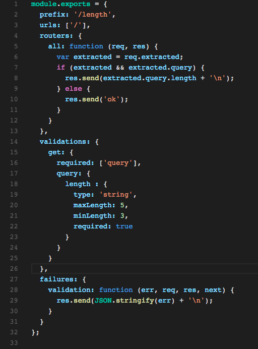
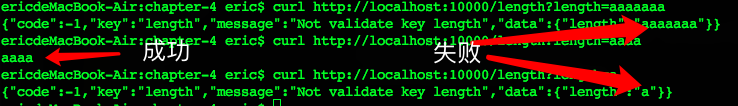
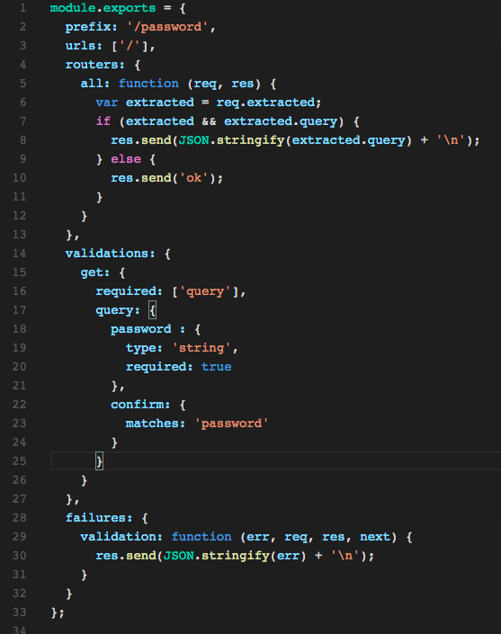
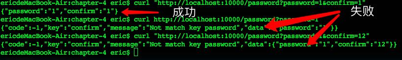
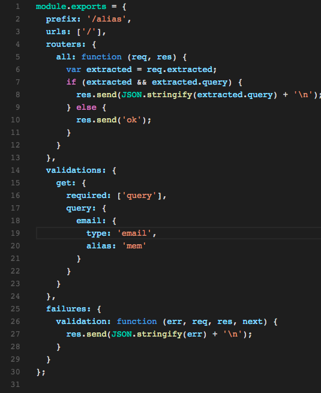
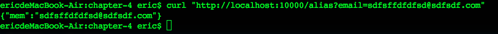
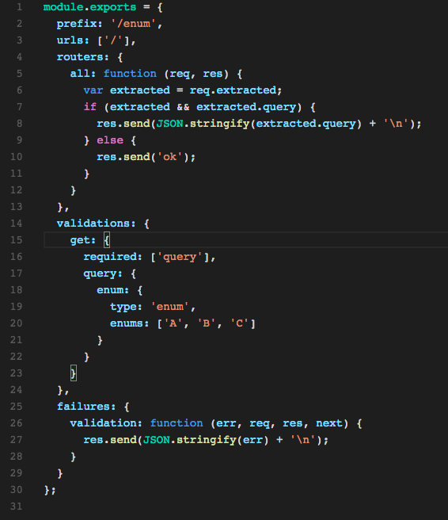
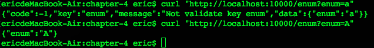

# 通过vig实现对输入数据的校验详解

上一讲我们讲到了数据校验的基本规则与提取方法，但是我们只讲到了int类型的校验。
这一讲我们再详细的讲解vig更加强大的校验机制。

# vig校验的类型与类型外的特殊方法讲解

除了校验类型之外，我们通常还会有一些附属的校验要求。这一节我们主要介绍几个常用的校验类型与特殊方法。


## 对字符串限定长度

表达形式：

```
max: {
  type: 'string',
  maxLength: 5,
  minLength: 2,
  required: true
}
```

对于如下的代码：



我们的执行结果是这样的：



第一种情况是长度超过返回错误，
第二种情况是正确的返回结果.
第三种情况是长度过短返回的错误。

## 密码确认或者字符匹配

在输入校验过程中，我们经常碰到的是两次密码需要的匹配情况，vig里配置密码与确定密码变的非常容易。

只需要在字段里添加<code>matches</code>字符，找到要对应的字段名即可。

表达形式如下：

```
password: {
  type: 'string',
  maxLength: 5,
  minLength: 2,
  required: true
},
confirm: {
  matches: 'password'
}
```

对于如下的代码：



我们的执行结果是这样的：




第一种情况是正确的返回结果。
第二，三种情况都是匹配错误的情况。

## 别名提取(alias)

有时候输入输出接口的命名与你的系统命令并不一致，这时你可以通过别名的方式将数据名修改成你想要的。

表达形式如下：

```
 alias: {
   type: 'email',
   alias: 'mem'
 }
```

对于如下的代码：



我们的执行结果是这样的：



将email提取成了mem。

## enum类型

enum类型用于校验类型受限的字符串。

表达形式如下：

```
enum: {
  type: 'enum',
  enums: ['A', 'B', 'C']
}
```

对于如下的代码：



我们的执行结果是这样的：



只要不是['A', 'B', 'C']中的值，校验就都会失败。


# 小结

这一节课，我们主要讲解了web校验中非常实用的功能与基本的类型，是不是感觉一下子提取与校验数据一下子特别的没有负担了呢？

下一节，我们将继续讲解常用并且特殊的类型与方法以及常用的类型用法。


另：如果你对nodejs开发或者开源项目感兴趣，也欢迎加入我们的QQ开发群：
nodejs全栈开发群： 423652352
nodejs开源项目交流群： 312685910

也可以关注我们的公共帐号: frontend-guru
进行咨询与了解。


