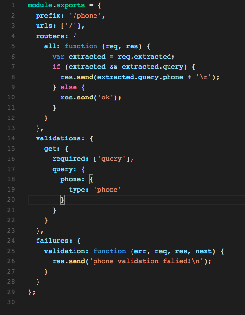
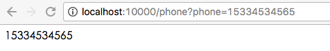
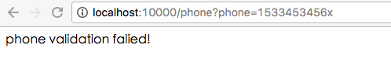
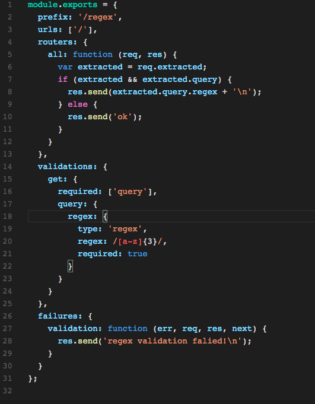
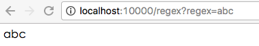
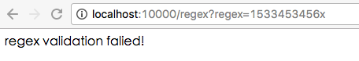
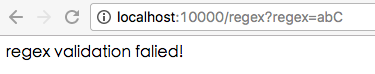

# 通过vig实现对输入数据的校验详解(二)

上一讲我们讲到了几个重要的类型与检测方法，这一讲，我们继续介绍常用用的数据类型的校验。


## 对移动电话号码的检验


表达形式：

```
phone: {
  type: 'phone'
}
```

对于如下的代码：



我们的执行结果是这样的：

输入正确的手机号:




输入错误的手机号：



## 自定义正则表达式

虽然vig默认提供了很多类型的检测能力，但是这些类型仍可能无法满足您的需求，所以vig也支持正则表达式的校验，让您可以完全自己控制所有的输入参数。

表达形式：

```
fieldname : {
  type: 'regex',
  regex: /xxx/
}
```

对于如下的代码：



我们的执行结果是这样的：

输入正确的字符串:




输入错误的字符串：






# 小结

这一节课，我们已经将vig里的重要的校验方式已经讲完了，通过以上的校验技巧将可以帮助你校验除文件外的所有的输入数据。

下一节，我们将讲解如何在vig里使用数据库，如何编写模型，以及如何使用模型输入数据。

如果你对vig框架的源码感兴趣，可以直接访问：

https://github.com/calidion/vig

查看。

另：如果你对nodejs开发或者开源项目感兴趣，也欢迎加入我们的QQ开发群：
nodejs全栈开发群： 423652352
nodejs开源项目交流群： 312685910

也可以关注我们的公共帐号: frontend-guru
进行咨询与了解。


