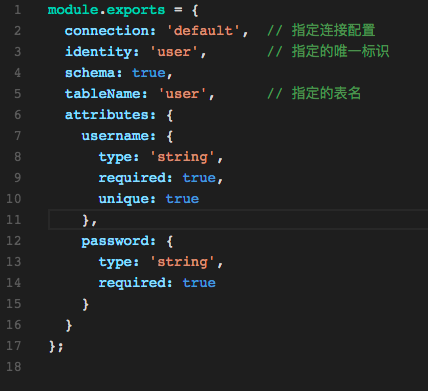
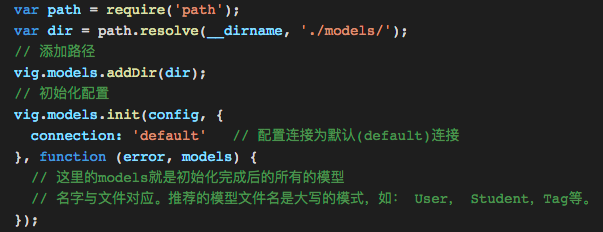
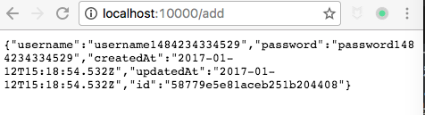

# 通过vig实现对数据库的操作

上面几讲我们讲了vig对输入数据的校验，这一讲我们来讲一下vig对数据库操作的支持。
目前vig是基于waterline这个orm库来实现对数据库的操作的。
原因是他足够简单易用，方便书写，代码清晰。
waterline是sailsjs的默认ORM，而vig是受sailsjs启发的一个框架。


我们下面一起来看一下使用waterline定义数据库简单在那里。

# 定义数据模型

下面的代码是放在User.js里的代码，他定义了一个User的模型：



```js
module.exports = {
  connection: 'default',  // 指定连接配置
  identity: 'user',       // 指定的唯一标识
  schema: true,          
  tableName: 'user',      // 指定的表名
  attributes: {
    username: {
      type: 'string',
      required: true,
      unique: true
    },
    password: {
      type: 'string',
      required: true
    }
  }
};
```

# 初始化

vig里面提供了models对象来初始化模型。

1. vig.models.addDir
    通过vig.models.addDir来添加模型的路径。
    由于waterline限制的原因，目前vig的模型路径暂时是唯一的。
2. vig.models.init
    通过vig.models.init可以初始化模型的数据库配置并启动waterline。



```js
var path = require('path');
var dir = path.resolve(__dirname, './models/');
// 添加路径
vig.models.addDir(dir);     
// 初始化配置
vig.models.init(config, {
  connection: 'default'   // 配置连接为默认(default)连接
}, function (error, models) {
  // 这里的models就是初始化完成后的所有的模型
  // 名字与文件对应。推荐的模型文件名是大写的模式，如： User， Student，Tag等。
});
```

# 在Handler里调用

在初始化调用完成后，每个Handler里的req.models就可以调用包含你定义的模型了。
在这里就是User模型。代码如下：


```js
      User.create({
        username: username,
        password: password
      }).then(function(created) {
        res.send(created);
      });
```

这样对我们的模型的基本调用就完成了。

# 访问效果

由于我们的教程都是有具体的样例的，所以我们可以看一下样例返回的结果。
我们访问的地址是：http://localhost:10000/add，
结果如下：

```json
{
  "username":"username1484234334529",
  "password":"password1484234334529",
  "createdAt":"2017-01-12T15:18:54.532Z",
  "updatedAt":"2017-01-12T15:18:54.532Z",
  "id":"58779e5e81aceb251b204408"
}
```




# 小结

waterline是目前vig默认支持的ORM，未来可能还会有新的不同的ORM可以加入。
但是waterline确实是一个不错的ORM，从示例的代码可以看出来他是非常简单可配置的。
值得一试，vig将会优先推荐最精简，最实用的ORM。


